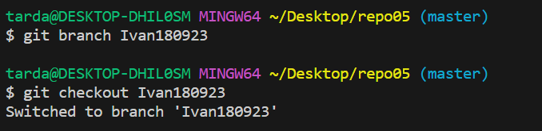

Repositorio 05
📌5.1 – Crea un directorio llamado repo05, esta vez tu decides como lo haces. Es decir, tendrás que
seleccionar uno de los dos caminos que hemos visto en los dos ejercicios anteriores. Pero si que
queremos que exista el repositorio el local y en remoto.
Creamos un nuevo directorio con ``mkdir`` de forma local
5.2 – Crea el fichero readme.md
Anadimos el fichero con ``git add readme.md``

5.3 - Crea una rama con tu nombre y la fecha actual (por ejemplo en mi caso la rama se llamará david02032022) y sitúate en dicha rama

