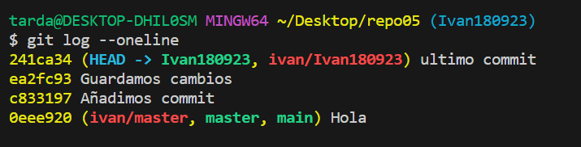
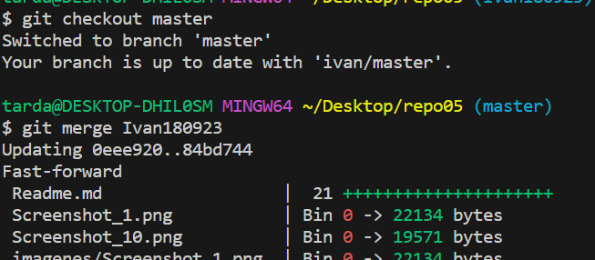
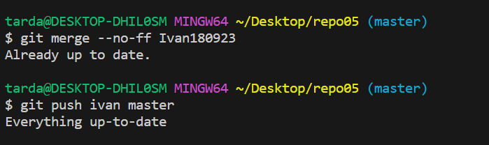
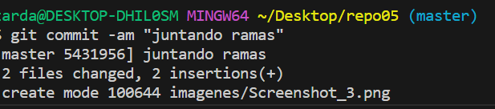
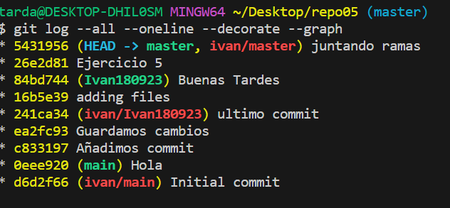

Repositorio 05

📌5.1 – Crea un directorio llamado repo05, esta vez tu decides como lo haces. Es decir, tendrás que
seleccionar uno de los dos caminos que hemos visto en los dos ejercicios anteriores. Pero si que
queremos que exista el repositorio el local y en remoto.
Creamos un nuevo directorio con ``mkdir`` de forma local
5.2 – Crea el fichero readme.md
Anadimos el fichero con ``git add readme.md``

5.3 - Crea una rama con tu nombre y la fecha actual (por ejemplo en mi caso la rama se llamará david02032022) y sitúate en dicha rama

5.4 – Haz 3 commits en la rama (david02032022)

- Hacemos los 3 commits

5.5 – En este caso, antes de hacer el merge sube ambas ramas al repositorio remoto. Verifica que se
hayan subido correctamente. Lo hacemos así, ya que cuando realicemos el merge si nos equivocas
podemos volver a clonar el repositorio sin necesidad de tener que volver a comenzar el ejercicio de 0.

5.6 – Basándote en el ejemplo que hemos visto anteriormente, realiza un commit no fast-forward en el que mergearemos la rama david02032022 con master.

5.7 – Visualiza el resultado tanto mediante el comando git log --all --oneline --decorate --graph, como desde el pluging de VSC

- Como vemos cuando hacemos el comando ``git log --all --oneline --decorate --graph`` y como podemos observar tenemos en color verde master que esta fusionado con Ivan180923  y el rojo el remoto.

5.8 – Explica las diferencias entre un merge FF y un merge no FF

- Un merge fast-forward es una fusión simple y lineal que avanza la rama objetivo hasta la punta de la rama que se está fusionando, sin crear un commit de fusión adicional. La historia de la rama fusionada se pierde.
- Un merge no fast-forward crea un nuevo commit de fusión, preservando la historia de ambas ramas y proporcionando un contexto más detallado sobre las fusiones.
